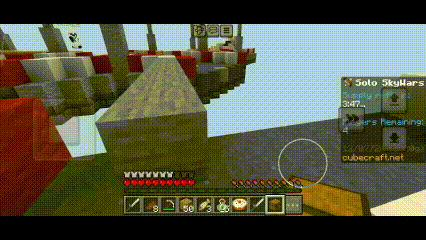

# Chest Overlay

  
  
  

## What is Chest Overlay?
**Chest Overlay** is a resource pack that allows you to move while a chest is open.

## Requirements
- **Touch screen**: This pack works only on touch screen devices.

## Installation
You can download and install **Chest Overlay** via one of the following methods:

- **GitHub Releases**: Download the latest version from the [Releases page](https://github.com/YasserNull/chest-overlay/releases).
- **CurseForge**: Download the latest version from [CurseForge](https://www.curseforge.com/minecraft/texture-packs/chest-overlay).

## License
**Chest Overlay** is licensed under the [GNU General Public License v3.0](LICENSE).

## Donate

[**Ko-fi**](https://ko-fi.com/yassernull)